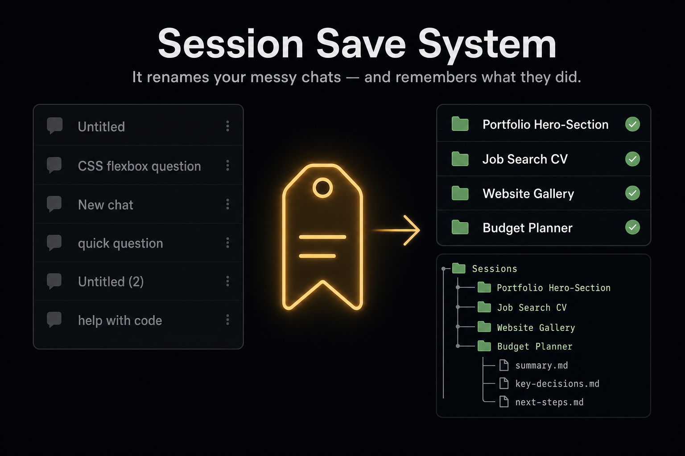

# Session Save System



**It renames your messy chats — and remembers what they did.**

Your AI chat list is 20 untitled conversations ("CSS flexbox question" that became a full website build). Session Save System fixes that with four commands for **Claude Code** — type `/session` and the whole suite autocompletes:

| Command | Alias | What it does |
|---|---|---|
| `/session-tag` | `/st` | **Tag this session** — names the chat for what it actually did, judges whether it's FINISHED / LIVE / STALE, saves a summary, and tells you what to run next. `/session-tag all` sweeps your whole chat list down to ≤5 recents. |
| `/session-save` | `/ss` | **Checkpoint** — quick timestamped "here's where I'm at" so nothing's lost if the chat ends. |
| `/session-summary` | `/ssum` | **Close out** — writes a readable summary + a technical resume-state, so any future chat can catch up cold. |
| `/session-audit` | `/sa` | **Weekly bird's-eye** — reads the week's logs back: what you achieved, plans you never actioned, what to do next. |

→ **New here? Read [USAGE.md](USAGE.md)** — when to use which command, with real scenarios.

## ⚡ How it's used — the gist

- 🏷 **End of every working chat → type `/st`.** It reads the session, renames the chat for what it *actually did*, and tells you what to run next. That's the whole habit.
- 💾 **Long session, stepping away → `/ss`.** One timestamped "here's where I'm at" block. Nothing is lost if the chat dies.
- ✅ **Work finished → `/ssum`.** Two files: a summary you can read, a resume-state any future chat can load. Session closed, findable forever.
- 🧹 **Chat list a mess → `/st all`.** Reviews every session, proposes names + keep/archive verdicts, waits for your approval. 20 chats → 5.
- 📊 **Sunday → `/sa`.** One report: what you achieved this week, what you started and dropped, what to do Monday.

**Bottom line:** one folder on your Desktop remembers every session — you just press save. 🗂

Everything saves to **one folder on your Desktop** (`~/Desktop/session-logs/` by default). No second-brain, no database, no accounts — just well-structured markdown you own.

## Install (60 seconds)

```bash
git clone https://github.com/youkistudios/session-save-system && cd session-save-system && ./install.sh
```

That's it. Open any Claude session and type `/session-tag` (or just `/st`).

## How it works

- **The name is the key.** `/st` names each session `<Project> Topic` (e.g. `Website Hero-Section`). That name becomes the chat title, the folder name, and the index row — so the chat list and the logs always agree.
- **Projects are YOURS, discovered automatically.** No hardcoded categories — the first time you work on something new, `/st` proposes a project name (from your repo/folder/topic) and files everything under it. Your registry lives in `sessions/_PROJECTS.md`.
- **One session = one record.** Re-running any command updates the same files (timestamped revisions), never duplicates.
- **Honest verdicts.** FINISHED allows leftover follow-ups; LIVE means the core work itself is unfinished; STALE means you won't return. That's how your recents stay at 5 instead of 20.

## Safety rules (built in, non-negotiable)

1. **Archive, never delete** — archiving a chat is always reversible.
2. **Capture before archive** — a chat is never archived until its knowledge is saved.
3. **One record per session** — re-runs update in place, never fork duplicates.
4. **Sweeps propose first** — `/st all` writes a review file for your approval; nothing is renamed or archived without your yes.

## Folder layout (created on install)

```
~/Desktop/session-logs/
  _INDEX.md                     ← one line per session, newest first — read this to catch up
  GUIDE.md                      ← the rulebook the skills follow
  sessions/
    _PROJECTS.md                ← your auto-built project registry
    <Project>/<date>_<slug>/    ← one folder per session
      tag.md · checkpoints.md · human.md · agent.md
  audits/
    <year>-W<week>_audit.md     ← weekly bird's-eye reports
```

## Requirements — read this honestly

- **Claude Code** (CLI or desktop app). The installer copies skills into `~/.claude/` — the claude.ai consumer app can't install these.
- **Chat renaming/archiving is automatic only where session-management tools exist** (the Claude Code desktop app). Everywhere else, `/session-tag` still does everything — reads the session, computes the truthful name, writes all logs — and hands you the title to set in one click. The logging system works 100% regardless; only the *automatic* rename is environment-dependent.

## Why manual save is a feature

This is Cmd-S, not autosave. You trigger it, so you know it happened — anyone who's lost a document to "autosave had it" knows the difference. The habit is one command at the end of a working chat: `/st`.

## Privacy

Your logs contain your work. They're plain markdown in a folder **you** own — nothing leaves your machine. Note: `~/Desktop` may be iCloud-synced on macOS; if you don't want your session logs in iCloud, install with `SAVE_SYSTEM_HOME` pointed somewhere unsynced.

**Bonus:** the logs folder opens beautifully as an Obsidian vault — `_INDEX.md` becomes your dashboard. Zero setup, entirely optional.

MIT licensed. Built because 20 untitled chats is a solvable problem.
