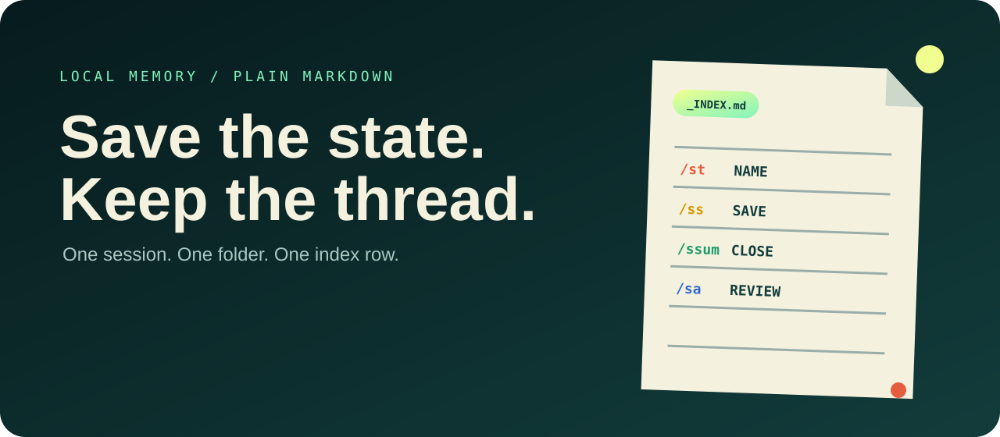

# Session Save System



**One memory home. Two agent clients. Four deliberate moments.** Session Save turns work in Claude Code and Codex into source-attributed, indexed, resumable records you own.

[Open the site](https://youkistudios.github.io/session-save-system/) · [Read the usage guide](USAGE.md) · [See the architecture](docs/ARCHITECTURE.md) · [Review the safety model](docs/SAFETY-MODEL.md)

> **Status: v2.0 alpha, tested local kernel.** Installer, migration, namespace, concurrency, index, audit-input, and uninstall behavior are exercised in isolated tests. Live end-to-end skill invocation in both Claude Code and Codex remains a release witness—not a production claim.

## The problem

AI work now crosses clients, but memory remains trapped inside each chat list. Claude can research a project, Codex can implement it, and neither record naturally tells the same project story. Throwing both into one undifferentiated folder creates collisions and erases provenance.

Session Save keeps one local home while preserving both truths:

1. all records belong to the user’s projects;
2. every record retains the client session that produced it.

## The product model

| Moment | Claude Code | Codex | Outcome |
|---|---|---|---|
| **Tag** | `/session-tag` or `/st` | `$session-tag` / Skills | Name, project, gist, assets, honest verdict |
| **Save** | `/session-save` or `/ss` | `$session-save` / Skills | Immutable in-flight checkpoint |
| **Summarize** | `/session-summary` or `/ssum` | `$session-summary` / Skills | Human close-out and technical resume state |
| **Audit** | `/session-audit` or `/sa` | `$session-audit` / Skills | One source-attributed project view across clients |

The behavior is shared. Invocation syntax is a client adapter detail.

## Shared file model

```text
session-logs/
├── _INDEX.md                         generated global view
├── GUIDE.md                          shared behavioral rulebook
├── sessions/
│   ├── _PROJECTS.md
│   └── <project>/
│       ├── claude/<date>_<slug>/
│       │   ├── record.json
│       │   ├── tag.md
│       │   ├── checkpoints/<event>.md
│       │   ├── human.md
│       │   └── agent.md
│       └── codex/<date>_<slug>/...
├── events/<date>/<event>.json
└── audits/global/<week>_audit.md
```

A client directory appears lazily on its first save. Project views aggregate Claude and Codex while the `client_id` remains present in every envelope, index row, and audit claim.

## Install

Requirements: macOS or Linux, Python 3, Claude Code and/or Codex.

```bash
git clone https://github.com/youkistudios/session-save-system
cd session-save-system
./install.sh
```

The default installs both adapters:

- Claude Code → `~/.claude/skills/` plus local slash-command aliases;
- Codex → `~/.agents/skills/`;
- shared config → `~/.config/session-save/config.json`;
- records → `~/Desktop/session-logs/` unless configured otherwise.

Choose another home before first install:

```bash
SESSION_SAVE_HOME="$HOME/Documents/session-logs" ./install.sh
```

Install only one adapter when needed:

```bash
SESSION_SAVE_CLIENTS=claude ./install.sh
SESSION_SAVE_CLIENTS=codex ./install.sh
```

GUI clients may require permission to write the chosen directory. Unsupported rename/archive controls degrade to a printed manual instruction; saving does not depend on them.

## Existing v1 records

The installer never silently moves them. It reports a required copy-first migration:

```bash
python3 scripts/session_save.py --home "$HOME/Desktop/session-logs" \
  migrate-v1 --client claude --dry-run

# Inspect every source and destination, then explicitly apply:
python3 scripts/session_save.py --home "$HOME/Desktop/session-logs" \
  migrate-v1 --client claude --apply
```

Migration copies legacy records under the Claude namespace, generates identity envelopes and a receipt, and preserves every original directory.

## Why there is a small kernel

An instruction-only system can write Markdown, but two open desktop clients must not race while editing one index. The dependency-free Python kernel owns only persistence mechanics:

- safe client/project paths;
- globally unique record and event IDs;
- client namespaces;
- immutable checkpoint allocation;
- serialized and atomic metadata writes;
- rebuildable global index;
- source-attributed audit input;
- copy-first migration.

Models still author the summaries. The four-moment product stays small.

## Verify

```bash
./tests/run.sh
python3 scripts/generate_manifest.py
python3 scripts/validate_repo.py
```

The 20-test suite currently covers dual-client installation, ownership collisions, recoverable updates, isolated namespaces, immutable checkpoints, 24 simultaneous writes, copy-first migration, global audits, proof-based uninstall, client ownership, symlink containment, traversal rejection, and skill-contract alignment.

## Safety contract

- **One home, namespaced writers.** Claude and Codex never share a source record directory.
- **Project first, provenance always.** Global views aggregate without erasing the client.
- **Derived index.** `_INDEX.md` can be rebuilt from source envelopes.
- **No silent merging.** Similar titles are not identity proof.
- **Archive, never delete. Capture before archive.**
- **Prove before uninstall.** Only hash-matching managed adapter files are removed.
- **Records are user data.** Shared config, logs, migrations, and backups are outside uninstall scope.

## Honest limits

- This does not synchronize raw transcripts or recover context a client does not expose.
- Model-authored summaries can be incomplete or wrong.
- Stable session IDs, chat renaming, history listing, and archive controls vary by client.
- Claude Desktop/Cowork is not claimed by the Claude Code adapter.
- Windows support and non-Claude/Codex adapters are not yet claimed.
- A local directory may still be synchronized by iCloud or another service.

## License

MIT © 2026 Youki Studios. See [LICENSE](LICENSE), [PROVENANCE.md](PROVENANCE.md), and [SECURITY.md](SECURITY.md).
